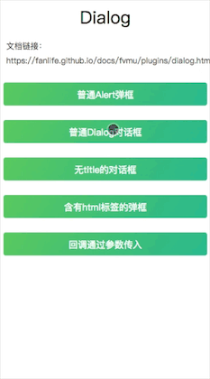

# Dialog

## 基本用法

```javascript
import { Dialog } from 'fvmu'

Dialog
    .open({
        type: 'confirm',
        title: '温馨提示',
        content: '这是一个普通的Dialog对话框，有两个按钮。字体默认居左'
    })
    .ok(() => {
        Toast.open('你点了确定按钮')
    })
    .cancel(() => {
        Toast.open('你点了取消按钮')
    })
```



### 参数说明
参数 | 说明 | 类型 | 可选值 | 默认值 
-|-|-|:-:|:-:
type | 弹框类型 | string | alert/confirm | alert
content | 弹框文案，必填 | string | - | -
title | 弹框标题，不传则不显示 | string | — | -
align | content文字对齐 | string | left/center/right | left
contentClass | content另加的class | string | — | —
confirmBtnText | 确定按钮文案(最多4个字) | string | — | 确定
cancelBtnText | 取消按钮文案(最多4个字) | string | — | 取消
confirmBtnClass | 确定按钮另加的class | string | — | —
cancelBtnClass | 取消按钮另加的class | string | — | —

## 快捷用法

```javascript
Dialog.alert('普通Alert弹框，只有一个按钮')
    .ok(() => {
        Toast.open('你点了确定按钮')
    })
// 等同于
Dialog
    .open({
        type: 'alert',
        content: '普通Alert弹框，只有一个按钮'
    })
    .ok(() => {
        Toast.open('你点了确定按钮')
    })
```

## 回调传入方式

### 回调传入方式有三种：

1. 链式写法(推荐)

```javascript
Dialog
    .open({
        content: '我是一个对话框'
    })
    ok(() => {
        //点确定按钮回调
    })
    .cancel( () => {
        //点取消按钮回调
    })
```

2. `Dialog.open`参数传入

```javascript
Dialog
    .open({
        content: '我是一个对话框'
    }, action => {
        if(action === 'confirm'){
            //点确定按钮回调
        }else{
            //点取消按钮回调
        }
    })
```

3. 作为`Dialog.open`的配置项

```javascript
Dialog
    .open({
        content: '我是一个对话框',
        confirmCbk: () => {
            //点确定按钮回调
        },
        cancelCbk: () => {
            //点取消按钮回调
        }

    })
```