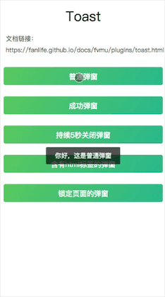

# Toast

## 基本用法

```javascript
import { Toast } from 'fvmu'

Toast.open('我是一个弹窗')
```


## 标准用法

```javascript
Toast.open({
    type: 'normal',
    content: '我是一个弹窗',
    duration: 2500,
    lock: false,
    onClose: () => {
        alert('ok')
    }
})
```

### 参数说明
参数 | 说明 | 类型 | 可选值 | 默认值 
-|-|-|:-:|:-:
type | 弹窗类型(弹窗文字颜色不同) | string | normal/success/warning/error | normal
content | 弹窗文案，必填 | string | - | -
duration | 持续时间(毫秒) | number | — | 2500
lock | 是否锁定屏幕(锁定则屏幕无法点击) | boolean | — | false
onClose | 弹窗关闭后回调 | function | — | —

## 快捷用法

```javascript
Toast.open('我是一个普通弹窗');
// 等同于
Toast.open({
    type: 'normal',
    content: '我是一个普通弹窗'
});

Toast.success('我是一个成功弹窗');
Toast.error('我是一个错误弹窗');
Toast.warning('我是一个警告弹窗');
```
